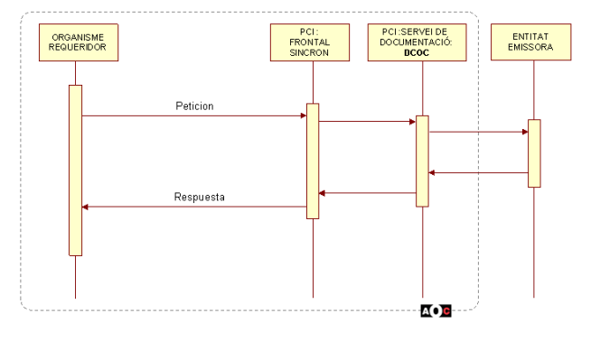
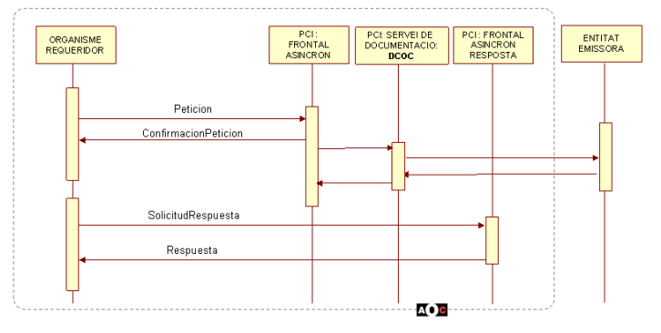
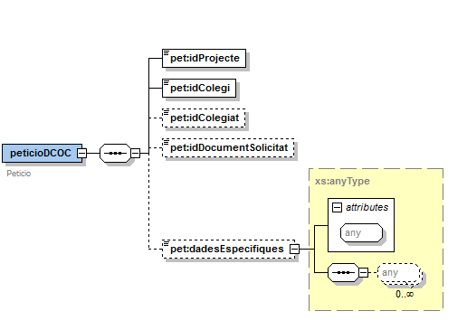
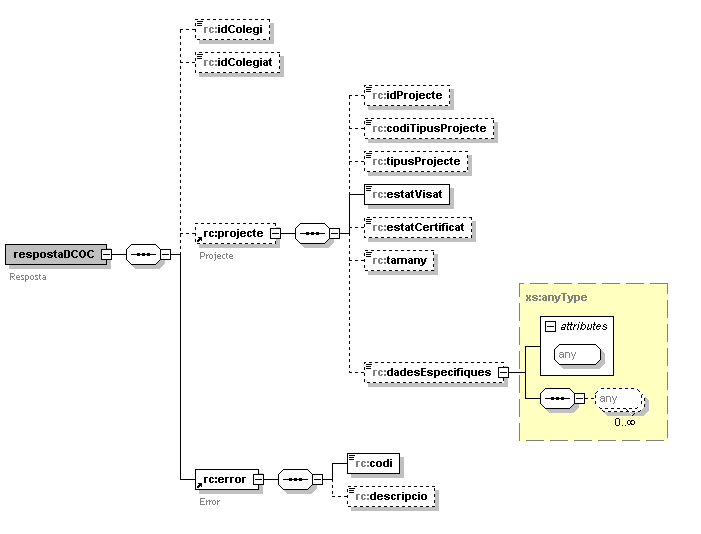
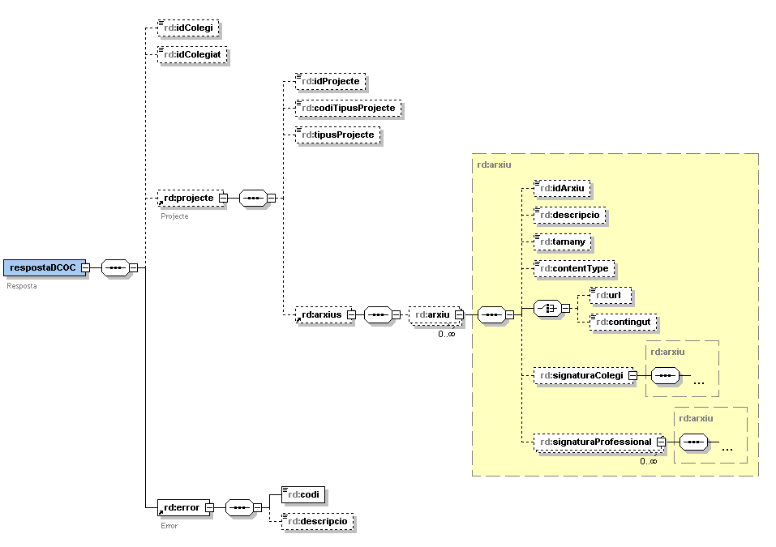
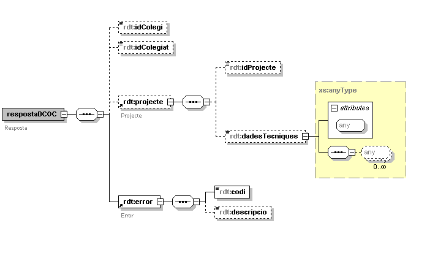

# Via Oberta – DCOC
Document d’integració del servei.

Podreu trobar els XSD's del servei en aquest repositori sota el directori [/schema](https://github.com/ConsorciAOC/VO-DCOC/tree/main/schema).

## Control del document

### Informació general

| **Títol:** | Via Oberta – DCOC |
| --- | --- |
| **Creat per:** | Carlos Mena |
| **A revisar per:** | Àlex Lopez |
| **A aprovar per:** |  |
| **Llista de distribució:** | |
| **Nom del document:** | DI - Via Oberta - DCOC.doc |

### Històric de revisions

| **Versió** | **Data** | **Autor** | **Comentaris** |
| --- | --- | --- | --- |
| V1.0 | 17/11/2008 | Carlos Mena | Creació del document |
| V1.1 | 17/02/2009 | Carlos Mena | S'ha actualitzat en funció dels canvis de modalitats i productes.|
| V1.2 | 03/04/2009 | Carlos Mena | S'ha modificat l'esquema de la resposta per a la operació de consulta.|
| V1.3 | 15/09/2009 | Carlos Mena | S’ha actualitzat el format per a unificar-lo amb la resta de documents. . |
| V1.4 | 01/12/2009 | Carlos Mena | S’ha afegit la missatgeria del nou servei de Dades Tècniques i modificat el valor del camp estatVisat. |
| V1.5 | 26/03/2010 | Carlos Mena | S’ha modificat el valor del camp estaCertificat eliminant la restricció Si / No i modificat els visats del joc de proves. |
| V1.6 | 27/09/2012 | Carlos Mena | S'afegeix una nota en la s'indica que en les descàrregues de documents les URL's dels documents poden no estar disponibles a l sistema de fitxers en el cas que s'hagi exhaurit el temps de permanència al sistema.  |
| V1.7 | 21/02/2013 | Carlos Mena  | S’afegeix el camp opcional “idDocumentSolicitat” a la petició (tant del DCOC com del COCREF)  |

### Índex

- [1. Introducció](#1)
- [2. Transmissions de dades disponibles](#2)
	* [2.1. Fer una consulta](#2.1)
	* [2.2. Fer una descàrrega](#2.2)
	* [2.3. Fer una consulta de dades tècniques](#2.3)
- [3. Missatgeria dels serveis](#3)
   * [3.1. Consulta - <COL·LEGI>_CONSULTA](#3.1)
		* [3.1.1 Petició – dades genèriques](#3.1.1)
		* [3.1.2 Petició – dades específiques](#3.1.2)
		* [3.1.3 Resposta – dades específiques](#3.1.3)
		* [3.1.4 Valors del codi d’error](#3.1.4)
   * [3.2. Descàrrega (<COL·LEGI>_DESCARREGA_HTTP / <COL·LEGI>_DESCARREGA_FTP)](#3.2)
		* [3.2.1 Petició – dades genèriques](#3.2.1)
		* [3.2.2 Petició – dades específiques](#3.2.2)
		* [3.2.3 Resposta - dades específiques](#3.2.3)
		* [3.2.4 Resposta - dades genèriques](#3.2.4)
		* [3.2.5 Valors del codi d'error](#3.2.5)
   * [3.3. Dades tècniques (<COL·LEGI>_DADES_TECNIQUES)](#3.3)
   		* [3.3.1 Petició – dades genèriques](#3.3.1)
   		* [3.3.2 Petició – dades específiques](#3.3.2)
   		* [3.3.3 Resposta – dades específiques](#3.3.3)
- [4. Joc de proves](#4)
- [5. Annex – exemple de missatges](#4)

## 1 Introducció <a name="1"></a>
Aquest document detalla la missatgeria associada al servei de Documentació de Col·legis Oficials de
Catalunya (en endavant DCOC).
Per poder realitzar la integració cal conèixer prèviament la següent documentació: 
- Document del Servei Via Oberta.
- Document de Missatgeria Genèrica de la PCI del Consorci AOC.

## 2 Transmissions de dades disponibles <a name="2"></a>

Les dades disponibles a través del servei són les que es presenten a continuació:
- **EMISSORS**:Col·legis Oficials

| **PRODUCTE** | **MODALITAT** | **DESCRIPCIO** |
| --- | --- | --- |
| **DCOC_<COL·LEGI>**| [<COL·LEGI>_CONSULTA](#3.1) | Consulta si el projecte indicat està VISAT o no.|
| **DCOC_<COL·LEGI>**| [<COL·LEGI>_DESCARREGA_HTTP](#3.2) | Descarrega un projecte indicant que un cop descarregat, s’accedirà als documents via HTTP (les urls de la resposta vindran en format HTTP).  |
| **DCOC_<COL·LEGI>**| [<COL·LEGI>_DESCARREGA_FTP](#3.2) | Descarrega un projecte indicant que un cop descarregat, s’accedirà als documents via FTP (les urls de la resposta vindran en format FTP).|
| **DCOC_<COL·LEGI>**| [<COL·LEGI>_DADES_TECNIQUES ](#3.3) | Obté les dades tècniques d’un projecte visat.|

Així doncs, pel servei del DCOC es definiràn n productes (un per a cada col·legi integrat) i per a
cadascún d’aquests productes es definiràn quatre modalitats de consum: dues de consulta i dues de
descàrrega.
Un exemple de poducte amb les seves modalitats de consum seria: 
- Producte: DCOC_COAC
- Modalitats de consum:
	* COAC_CONSULTA: la modalitat de consulta permet fer la consulta al col·legi sobre si un projecte està visat electrònicament o no. Aquesta modalitat es síncrona. 
	* COAC_DESCARREGA_HTTP / COAC_DESCARREGA_FTP: les modalitats de descàrrega permeten la descarrega d’un projecte visat, sempre i quan el projecte estigui visat electrònicament i que el col·legi el posi a disposicio per poder fer la descàrrega. Aquesta modalitat és asíncrona. 
	* COAC_DADES_TECNIQUES: la modaditat de dades tècniques permet obtenir la informació amb les dades tècniques d’un determinat projecte visat. Aquesta modalitat es síncrona. 
		
Val a dir, que la resposta és la que ofereix el col·legi, i per tant, queda sota la seva reponsabilitat la
garantia de si el projecte està visat convenientment, així com facilitar la seva descàrrega. Sota
aquesta premisa, serà l’entorn del requeridor el que faci les comprovacions i validacions que consideri
oportunes a efectes del procediment o tràmit en curs.

:warning: **El Consorci AOC no farà cap tipus de tractament a la resposta que envia el col·legi.**

### 2.1 Fer una consulta<a name="2.1"></a>
S’invocarà mitjançant el frontal síncron de la PCI.
<br/>A continuació es detalla el diagrama de seqüència de la modalitat de consum: 

<p align="center">

</p>
<p align="center">
<b> Figura 1 – Diagrama de seqüència - Consulta</b>	
</p>

### 2.2 Fer una descàrrega<a name="2.2"></a>
S’invocarà mitjançant el frontal asíncron de la PCI.
<br/>A continuació es detalla el diagrama de seqüència de la modalitat de consum: 
<p align="center">

</p>
<p align="center">
<b> Figura 2 – Diagrama de seqüència - Descàrrega</b>
</p>

### 2.3 Fer una consulta de dades tècniques <a name="2.3"></a>
S’invocarà mitjançant el frontal síncron de la PCI.
<br/>A continuació es detalla el diagrama de seqüència de la modalitat de consum: 
<p align="center">

</p>
<p align="center">
<b> Figura 3 – Diagrama de seqüència - Consulta de dades tècniques</b>
</p>

## 3 Missatgeria dels serveis<a name="3"></a>
A continuació es detalla la missatgeria corresponent a les modalitats de consum del DCOC. 
<br/><br/>Tot i que en la missatgeria genèrica de la PCI, no apareguin com a camps obligatoris, pel negoci que
implementa el DCOC, son obligatoris els següents elements de la petició: 
| _Element_ | _Descripció_ |
| --- | --- |
| Peticion/Atributos/Funcionario/NifFuncionario | Nif del funcionari que envia la petició.  |
| Peticion/Solicitudes/SolicitudTransmision/DatosGenericos/Transmision/IdTransmision  | Identificador de la sol·licitud. S’utilizarà per a temes d’auditoria.|
### 3.1 Consulta - <COL·LEGI>_CONSULTA <a name="3.1"></a>
A partir de l’identificador de projecte i l’acrònim del col·legi, informa si el projecte està visat.
<br/>Opcionalment es pot indicar l’identificador d’un col·legiat. 

Les possibles respostes son: 
* El projecte està visat 
* El projecte no està visat.
* Es pot obtenir un altre estat en cas d’una resposta excepcional.

### 3.1.1 Petició – dades genèriques <a name="3.1.1"></a>
| _Element_ | _Descripció_ | _Valor_ |
| --- | --- | --- |
|Peticion/Atributos/CodigoProducto |Codi producte |DCOC_<COL·LEGI>|
|Peticion/Atributos/CodigoCertificado |Codi certificat |<COL·LEGI>_CONSULTA|
|Peticion/Solicitudes/SolicitudTransmision/DatosGenericos/Transmision/CodigoCertificado | Codi certificat |<COL·LEGI>_CONSULTA|

### 3.1.2 Petició – dades específiques <a name="3.1.2"></a>
<p align="center">

</p>

| **Missatge xml  <br/> (P)etició/(R)esposta/(S)ubelement** | **Nom paràmetre (P) <br/> atribut(A)** | **Oblig.** | **Comentaris** |
| --- | --- | --- | --- |
|Peticio(P)|idProjecte(P)|X|Identificador del projecte que es vol sol·licitar. |
|Peticio(P)|idColegi(P)|X|Identificador del col·legi al qual pertany el projecte que es vol sol·licitar. El valor correspon a l’acrònim (en majúscules) del col·legi. Ex: COAC.  |
|Peticio(P)|idColegiat(P)||Identificador del col·legiat del document  |
|Peticio(P)|idDocumentSolicitat(P)||Identificador del tipus de document que es vol sol·licitar (només aplica a la operació de dades tècniques).  |
|Peticio(P)|dadesEspecifiques||Camp de tipus anyType que permet afegir informació extra a la petició.  |

### 3.1.3 Resposta – dades específiques <a name="3.1.3"></a>
<p align="center">

</p>

| **Missatge xml  <br/> (P)etició/(R)esposta/(S)ubelement** | **Nom paràmetre (P) <br/> atribut(A)** | **Oblig.** | **Comentaris** |
| --- | --- | --- | --- |
|respostaDCOC (R)|idColegi(P)||Identificador del col·legi al qual pertany el projecte que es vol sol·licitar. El valor correspon a l’acrònim (en majúscules) del col·legi. Ex: COAC. |
|respostaDCOC (R)|idColegiat(P)||Identificador del col·legiat del projecte.|
|respostaDCOC (R)|projecte (P)||Subelement de tipus projecte.|
|respostaDCOC (R)|error (P)|X|Subelement de tipus error.   |
|error (S)|codi (P) |X|Codi de l’error. En cas de resposta correcta el valor serà 0.  |
|error (S)|descripcio (P) ||Descripció de l’error.|
|projecte (S) |idProjecte (P)||Identificador del projecte sol·licitat. |
|projecte (S) |codiTipusProjecte (P)||Codi del tipus de projecte. Només vindrà informat en el cas en que l’emissor ho informi. Ex: 2 |
|projecte (S) |tipusProjecte (P)||Indica el tipus de projecte. Només vindrà informat en el cas en que l’emissor ho informi. Ex: Projecte de tipus Bàsic.|
|projecte (S) |estatVisat (P)|X|Indica si el projecte està visat o no. Els valors seran VISAT TELEMATICAMENT, NO VISAT TELEMATICAMENT,NO AUTORITZAT o EN TRÀMIT.|
|projecte (S) |estatCertificat (P)||Indica si el projecte té certificat d’idoneïtat. Els valors els determinarà el propi col·legi emissor.|
|projecte (S) |tamany (P)||Grandària total (en bytes) dels fitxers que composen el projecte sol·licitat. Només vindrà informat en cas en que l’emissor ho informi.|
|projecte (S) |dadesEspecifiques (P)||Bloc any que serveix per a indicar qualsevol informació ‘extra’. Son dades proporcionades per l’emissor final i no es fa cap tipus de tractament.|

### 3.1.4 Valors del codi d’error  <a name="3.1.4"></a>

A continuació es detallen els valors possibles pel camp codi de l’error:
|Codi error| Valor|
| --- | --- |
|0|No error.|
|1|Error intern al sistema.|
|2|Error en la comunicació amb el col·legi. |
|3|Error en la resposta que envia el col·legi|
|4|No existeix el col·legi sol·licitat|
|5|El col·legi sol·licitat està desactivat|
|> 5|Altres errors|

## 3.2  Descàrrega (<COL·LEGI>_DESCARREGA_HTTP / <COL·LEGI>_DESCARREGA_FTP)  <a name="3.2"></a>

A partir de l’identificador de projecte i l’acrònim del col·legi, s’obté un enllaç per a poder descarregar
un projecte visat. En el cas en que el document sigui un XML també s’obté el contingut del XML en un
camp de la pròpia resposta. <br/>Opcionalment es pot indicar l’identificador d’un col·legiat.

Les possibles respostes son: 
* El projecte no està visat
* El projecte està visat. Es descarregarà el document via FTP.
* El projecte està visat. Es descarregarà el document via HTTP.
* El projecte està visat. Es un projecte on el document associat es un XML i per tant el contingut està inclós en la pròpia resposta. 

### 3.2.1 Petició – dades genèriques <a name="3.2.1"></a>
|Element| Descripció|Valor|
| --- | --- | --- |
|Peticion/Atributos/CodigoProducto |Codi producte|DCOC_<COL·LEGI> |
|Peticion/Atributos/CodigoCertificado  |Codi certificat|<COL·LEGI>_DESCARREGA_HTTP <COL·LEGI>_DESCARREGA_FTP |
|Peticion/Solicitudes/SolicitudTransmision/DatosGenericos/Transmision/CodigoCertificado|Codi certificat|<COL·LEGI>_DESCARREGA_HTTP <COL·LEGI>_DESCARREGA_FTP  |

### 3.2.2 Petició – dades específiques <a name="3.2.2"></a>
Idèntica a la petició de consulta: [3.1.2 Petició – dades específiques](#3.1.2)

### 3.2.3 Resposta – dades específiques <a name="3.2.3"></a>
<p align="center">

</p>

| **Missatge xml  <br/> (P)etició/(R)esposta/(S)ubelement** | **Nom paràmetre (P) <br/> atribut(A)** | **Oblig.** | **Comentaris** |
| --- | --- | --- | --- |
|respostaDCOC (R)|idColegi(P)||Identificador del col·legi al qual pertany el projecte que es vol sol·licitar. El valor correspon a l’acrònim (en majúscules) del col·legi. Ex: COAC. |
|respostaDCOC (R)|idColegiat(P)||Identificador del col·legiat del projecte.|
|respostaDCOC (R)|projecte (P)||Subelement de tipus projecte.|
|respostaDCOC (R)|error (P)|X|Subelement de tipus error.   |
|error (S)|codi (P) |X|Codi de l’error. En cas de resposta correcta el valor serà 0.  |
|error (S)|descripcio (P) ||Descripció de l’error.|
|projecte (S)|idProjecte (P)||Identificador del projecte sol·licitat. |
|projecte (S)|codiTipusProjecte (P)||Codi del tipus de projecte. Només vindrà informat en el cas en que l’emissor ho informi. Ex: 2 |
|projecte (S)|tipusProjecte (P) ||Indica el tipus de projecte. Només vindrà informat en el cas en que l’emissor ho informi. Ex: Projecte de tipus Bàsic.|
|projecte (S)|arxius (P) ||Subelement de tipus arxius|
|arxius (S) |arxiu (P)||Llista d’arxius que l’emissor envia com a resposta. Cadascún d’aquests fitxers pot representar dades o signatures corresponents al projecte requerit. No s’admetran ZIPs. |
|arxiu (S) |idArxiu (P)|| Identificador de l’arxiu. |
|arxiu (S)|descripcio (P)||Descripció de l’arxiu que es retorna. Si l’arxiu es un certificat d’idoneïtat, el contigut d’aquest camp serà CERTIFICAT IDONEÏTAT. |
|arxiu (S)|tamany (P)||Grandària de l’arxiu (en bytes). |
|arxiu (S)|contentType (P) ||MimeType del arxiu. Ex: text/XML...|
|arxiu (S)|url (P)||Path relatiu al fitxer per descarregar. |
|arxiu (S)|contingut||Certificat en format XML, si s’escau|
|arxiu (S)|signaturaColegi(P)||Subelement de tipus arxiu. Com a màxim hi haurà 1 signatura que correspon a la del col·legi que visa el document. |
|arxiu (S)|signaturaProfessional (P)||Subelement de tipus arxiu. Poden venir N signatures, Correspon a la signatura del document per part d’un professional(qui visa el projecte) |

### 3.2.4 Resposta – dades genèriques <a name="3.2.4"></a>
Aquesta modalitat de consum també informa camps optatius de la missatgeria genèrica. El camp que s’informa és el següent: Respuesta / Transmisiones / Datos Genericos / Ficheros que es correspon amb el camp respostaDCOC / projecte / arxius de la resposta específica. Així doncs els valors dels camps de la resposta genèrica seran els següents: 

| *Element* | *Descripció* | *Valor*|
| --- | --- | --- | 
|Ficheros / Fichero / URLDescarga | Url de descàrrega del fitxer | arxius / arxiu / url |
|Ficheros / Fichero / Id  | Identificador del fitxer  | arxius / arxiu / idArxiu |
|Ficheros / Fichero / Via  | Indica si es un fitxer d’entrada o de sortida.   | Salida |


>:warning: Els documents associats a aquestes URLs generades a la resposta **un temps de permanència determinat dins del sistema de fitxers.** Es possible que, malgrat obtenir una resposta correcta, els fitxers no estiguin disponibles per aquest motiu. Per a més informació consultar el temps de permanència dels documents al sistema de fitxers al departament de suport d’integració (suport.integracio@aoc.cat).

### 3.2.5 Valors del codi d’error  <a name="3.2.5"></a>
A continuació es detallen els valors possibles pel camp codi de l’error:

|Codi error| Valor|
| --- | --- |
|-3|El col·legi emissor no autoritza la descàrrega del projecte.|
|-2|Projecte no visat. |
|-1|Projecte en procés de descàrrega.|
|0|No error.|
|1|Error intern al sistema. |
|2|Error en la comunicació amb el col·legi.|
|3|Error en la resposta que envia el col·legi|
|4|No existeix el col·legi sol·licitat|
|5|El col·legi sol·licitat està desactivat|
|>5|Altres errors|

## 3.3 Dades tècniques (<COL·LEGI>_DADES_TECNIQUES) <a name="3.3"></a>
A partir de l’identificador de projecte i l’acrònim del col·legi, informa les dades tècniques del projecte. Opcionalment es pot indicar l’identificador d’un col·legiat.<br/> <br/>El format del camp de la resposta que informarà de les dades tècniques (respostaDCOC > projecte > dadesTecniques) pot ser diferentt per cadascún dels col·legis, que que en funció del tiupus de col·legi professional les dades serràn molt diverses


### 3.3.1 Petició – dades genèrique <a name="3.3.1"></a>

| *Element* | *Descripció* | *Valor*|
| --- | --- | --- | 
|Peticion/Atributos/CodigoProducto | Codi producte | DCOC_<COL·LEGI> |
|Peticion/Atributos/CodigoCertificado   | Codi certificat  | <COL·LEGI>_DADES_TECNIQUES |
|Peticion/Solicitudes/SolicitudTransmision/DatosGenericos/Transmision/CodigoCertificado | Codi certificat   | <COL·LEGI_DADES_TECNIQUES|

### 3.3.2 Petició – dades específiques <a name="3.3.2"></a>
Idèntica a la petició de consulta: [3.1.2 Petició – dades específiques](#3.1.2)

### 3.3.3 Resposta – dades específiques <a name="3.3.3"></a>
<p align="center">

</p>

| **Missatge xml  <br/> (P)etició/(R)esposta/(S)ubelement** | **Nom paràmetre (P) <br/> atribut(A)** | **Oblig.** | **Comentaris** |
| --- | --- | --- | --- |
|respostaDCOC (R)|idColegi(P)||Identificador del col·legi al qual pertany el document que es vol sol·licitar. El valor correspon a l’acrònim (en majúscules) del col·legi. Ex: COAC.
|respostaDCOC (R)|idColegiat (P)||Identificador del col·legiat del document.
|respostaDCOC (R)|projecte (P)||Subelement de tipus projecte. 
|respostaDCOC (R)|error (P)|X|Subelement de tipus error.
|projecte (S)|idProjecte (P) ||Identificador del projecte sol·licitat
|projecte (S)|dadesTecniques (P) ||Camp de tipus anyType amb la informació de les dades tècniques. Dependrà del format de l’emissor final, per això es un camp any.|
|error (S)|codi (P)|X|Codi de l’error. En cas de resposta correcta el valor serà 0. |
|error (S)|descripcio (P)||Descripció de l’error.|

## 4 Joc de proves <a name="4"></a>

Els diferents col·legis proporcionen una sèrie de projectes visats per a poder fer les proves. Les
següents dades de prova estan disponibles a l’entorn de pre-producció: 

| **ID<br/>COL·LEGI** | **ID <br/> PROJECTE** | **ID <BR/> COL·LEGIAT** | **OBSERVACIONS** |
| --- | --- | --- | --- |
|COAC|ARQ-2009-2060000673|-|Visat. PDF.|
|COAC|ARQ-2009-2060000695|-|Visat. PDF.|
|COAC|ARQ-2060-2060000695 |-|Visat. PDF.|
|CAATB|ART-2010-0000000000000008|-|Visat. PDF.|
|CAATB|ART-2010-0000000000000009|-|Visat. En tràmit i sense certificat idoneïtat. |
|CAATB|ART-2010-0000000000000010|-|No visat, no certificat |
|COIT|P03701972|10886||Visat. PDF.|
|APATGN|E10-01338/01||Visat. PDF.|
|CETIB|INS-2010-2010900001|99998|Visat. PDF. Amb certificat idoneïtat|
|COEIC|ENS-2010-B-393061 |-|Visat. PDF.|

## Annex – exemple de missatges

### Exemple de petició

```xml
<Peticion xmlns="http://gencat.net/scsp/esquemes/peticion">
	<Atributos>
		<IdPeticion>MENI-DESCARREGA-DCOC2008-2-ocupacio</IdPeticion>
		<NumElementos>1</NumElementos>
		<TimeStamp>2007-04-18 17:35:02.454</TimeStamp>
		<Estado>
			<CodigoEstado/>
			<CodigoEstadoSecundario/>
			<LiteralError/>
			<TiempoEstimadoRespuesta>0</TiempoEstimadoRespuesta>
		</Estado>
		<CodigoCertificado>COAC_DESCARREGA_HTTP</CodigoCertificado>
		<CodigoProducto>DCOC_COAC</CodigoProducto>
		<DatosAutorizacion>
			<IdentificadorSolicitante>CAOC</IdentificadorSolicitante>
			<NombreSolicitante>CAOC</NombreSolicitante>
			<Finalidad>TEST</Finalidad>
		</DatosAutorizacion>
		<Emisor>
			<NifEmisor>77116347S</NifEmisor>
			<NombreEmisor>Carlos MENA</NombreEmisor>
		</Emisor>
		<IdSolicitanteOriginal>MAP</IdSolicitanteOriginal>
		<NomSolicitanteOriginal>MAP</NomSolicitanteOriginal>
		<Funcionario>
			<NombreCompletoFuncionario>FUNCIONARIO</NombreCompletoFuncionario>
			<NifFuncionario>99999999R</NifFuncionario>
			<EMailFuncionario/>
		</Funcionario>
	</Atributos>
	<Solicitudes>
		<SolicitudTransmision>
			<DatosGenericos>
				<Emisor>
					<NifEmisor>Q0801175A</NifEmisor>
					<NombreEmisor>CAOC</NombreEmisor>
				</Emisor>
				<Solicitante>
					<IdentificadorSolicitante>CAOC</IdentificadorSolicitante>
					<NombreSolicitante>CAOC</NombreSolicitante>
					<Finalidad>FINALITAT</Finalidad>
					<Consentimiento>Si</Consentimiento>
					<Funcionario>
						<NombreCompletoFuncionario>FUNCIONARIO</NombreCompletoFuncionario>
						<NifFuncionario>99999999R</NifFuncionario>
						<EMailFuncionario/>
					</Funcionario>
				</Solicitante>
				<Titular>
					<TipoDocumentacion>NIF</TipoDocumentacion>
					<Documentacion>99999999R</Documentacion>
					<NombreCompleto>Pere Parra Polser</NombreCompleto>
					<Nombre>Pere</Nombre>
					<Apellido1>Parra</Apellido1>
					<Apellido2>Polser</Apellido2>
				</Titular>
				<Transmision>
					<CodigoCertificado>COAC_DESCARREGA_HTTP</CodigoCertificado>
					<IdSolicitud>AOC00000000100374</IdSolicitud>
					<IdTransmision>EXPEDIENT</IdTransmision>
					<FechaGeneracion>18042007</FechaGeneracion>
				</Transmision>
			</DatosGenericos>
			<DatosEspecificos>
				<pet:peticioDCOC xmlns:pet="http://aoc.net/dcoc/v2/peticio" xmlns:xsi="http://www.w3.org/2001/XMLSchema-instance">
					<pet:idProjecte>AS-0-20080703-111</pet:idProjecte>
					<pet:idColegi>COAC</pet:idColegi>
				</pet:peticioDCOC>
			</DatosEspecificos>
		</SolicitudTransmision>
	</Solicitudes>
</Peticion>
```

### Exemple resposta – Cas consulta

```xml
<res:Respuesta xmlns:res="http://gencat.net/scsp/esquemes/respuesta">
	<res:Atributos>
		<res:CodigoCertificado>CAATB_CONSULTA</res:CodigoCertificado>
		<res:CodigoProducto>DCOC_CAATB</res:CodigoProducto>
		<res:IdPeticion>MON1253001138427</res:IdPeticion>
		<res:IdSolicitanteOriginal>9821920002</res:IdSolicitanteOriginal>
		<res:NomSolicitanteOriginal>Consorci Administració Oberta E. de
			Catalunya</res:NomSolicitanteOriginal>
		<res:NumElementos>1</res:NumElementos>
		<res:TimeStamp>2009-09-15T09:52:19.49+02:00</res:TimeStamp>
		<res:Emisor>
			<res:NifEmisor>Q0801175A</res:NifEmisor>
			<res:NombreEmisor>CAOC</res:NombreEmisor>
		</res:Emisor>
		<res:Estado>
			<res:CodigoEstado>0003</res:CodigoEstado>
			<res:CodigoEstadoSecundario/>
			<res:LiteralError>OK</res:LiteralError>
			<res:TiempoEstimadoRespuesta>0</res:TiempoEstimadoRespuesta>
		</res:Estado>
		<res:Funcionario>
			<res:NombreCompletoFuncionario>MONITOR CAOC</res:NombreCompletoFuncionario>
			<res:NifFuncionario>MONITOR CAOC</res:NifFuncionario>
			<res:EMailFuncionario/>
			<res:CertificadoDigital/>
		</res:Funcionario>
	</res:Atributos>
	<res:Transmisiones>
		<res:TransmisionDatos>
			<res:DatosGenericos>
				<res:Emisor>
					<res:NombreEmisor>CAOC</res:NombreEmisor>
					<res:NifEmisor>Q0801175A</res:NifEmisor>
				</res:Emisor>
				<res:Solicitante>
					<res:IdentificadorSolicitante>9821920002</res:IdentificadorSolicitante>
					<res:NombreSolicitante>Consorci Administració Oberta E. de
						Catalunya</res:NombreSolicitante>
					<res:Finalidad>MONITORITZACIO</res:Finalidad>
					<res:Consentimiento>Si</res:Consentimiento>
					<res:Funcionario>
						<res:NombreCompletoFuncionario>MONITOR CAOC</res:NombreCompletoFuncionario>
						<res:NifFuncionario>MONITOR CAOC</res:NifFuncionario>
						<res:EMailFuncionario/>
						<res:CertificadoDigital/>
					</res:Funcionario>
				</res:Solicitante>
				<res:Titular>
					<res:TipoDocumentacion>NIF</res:TipoDocumentacion>
					<res:Documentacion>33947442v</res:Documentacion>
					<res:NombreCompleto>Marta Valenti Lloret</res:NombreCompleto>
					<res:Nombre>Marta</res:Nombre>
					<res:Apellido1>Valenti</res:Apellido1>
					<res:Apellido2>Lloret</res:Apellido2>
				</res:Titular>
				<res:Transmision>
					<res:CodigoCertificado>CAATB_CONSULTA</res:CodigoCertificado>
					<res:FechaGeneracion>18042007</res:FechaGeneracion>
					<res:IdSolicitud>AOC00000000100373</res:IdSolicitud>
					<res:IdTransmision>EXPEDIENT</res:IdTransmision>
				</res:Transmision>
			</res:DatosGenericos>
			<res:DatosEspecificos>
				<res:respostaDCOC xmlns:ns="http://www.openuri.org/" xmlns:SOAPENV="http://schemas.xmlsoap.org/soap/envelope/" xmlns:xsd="http://www.w3.org/2001/XMLSchema" xmlns:xsi="http://www.w3.org/2001/XMLSchema-instance" xmlns:res="http://aoc.net/dcoc/v2/respostaConsulta">
					<res:idColegi>CAATB</res:idColegi>
					<res:projecte>
						<res:idProjecte>C-1019</res:idProjecte>
						<res:codiTipusProjecte>PR</res:codiTipusProjecte>
						<res:tipusProjecte>Projecte</res:tipusProjecte>
						<res:estatVisat>VISAT TELEMATIC</res:estatVisat>
					</res:projecte>
					<res:error>
						<res:codi>0</res:codi>
					</res:error>
				</res:respostaDCOC>
			</res:DatosEspecificos>
		</res:TransmisionDatos>
	</res:Transmisiones>
</res:Respuesta>
```


### Exemple resposta – Cas descàrrega – Document PDF

```xml
<res:Respuesta xmlns:res="http://gencat.net/scsp/esquemes/respuesta">
	<res:Atributos>
		<res:CodigoCertificado>CAATB_DESCARREGA_FTP</res:CodigoCertificado>
		<res:CodigoProducto>DCOC_CAATB</res:CodigoProducto>
		<res:IdPeticion>1252928201138</res:IdPeticion>
		<res:IdSolicitanteOriginal>1DPGO049</res:IdSolicitanteOriginal>
		<res:NomSolicitanteOriginal>DIRECCIO GENERAL DE MODERNITZACIO DE
			L'ADM.</res:NomSolicitanteOriginal>
		<res:NumElementos>1</res:NumElementos>
		<res:TimeStamp>2009-09-14T14:35:25.626+02:00</res:TimeStamp>
		<res:Emisor>
			<res:NifEmisor>A12345678</res:NifEmisor>
			<res:NombreEmisor>Consorci Adm. Oberta Electronica de Cat</res:NombreEmisor>
		</res:Emisor>
		<res:Estado>
			<res:CodigoEstado>0003</res:CodigoEstado>
			<res:CodigoEstadoSecundario/>
			<res:LiteralError>OK</res:LiteralError>
			<res:TiempoEstimadoRespuesta>0</res:TiempoEstimadoRespuesta>
		</res:Estado>
		<res:Funcionario>
			<res:NombreCompletoFuncionario>Josep Lluis Rodriguez
				Vazquez</res:NombreCompletoFuncionario>
			<res:NifFuncionario>22709619V</res:NifFuncionario>
			<res:EMailFuncionario>jlrodriguez@gencat.net</res:EMailFuncionario>
			<res:CertificadoDigital/>
		</res:Funcionario>
	</res:Atributos>
	<res:Transmisiones>
		<res:TransmisionDatos>
			<res:DatosGenericos>
				<res:Emisor>
					<res:NombreEmisor>Consorci Adm. Oberta Electronica de Cat</res:NombreEmisor>
					<res:NifEmisor>A12345678</res:NifEmisor>
				</res:Emisor>
				<res:Solicitante>
					<res:IdentificadorSolicitante>1DPGO049</res:IdentificadorSolicitante>
					<res:NombreSolicitante>DIRECCIO GENERAL DE MODERNITZACIO DE
						L'ADM.</res:NombreSolicitante>
					<res:Finalidad>MONITORITZACIO</res:Finalidad>
					<res:Consentimiento>Si</res:Consentimiento>
					<res:Funcionario>
						<res:NombreCompletoFuncionario>Josep Lluis Rodriguez
							Vazquez</res:NombreCompletoFuncionario>
						<res:NifFuncionario>22709619V</res:NifFuncionario>
						<res:EMailFuncionario>jlrodriguez@gencat.net</res:EMailFuncionario>
						<res:CertificadoDigital/>
					</res:Funcionario>
				</res:Solicitante>
				<res:Titular/>
				<res:Transmision>
					<res:CodigoCertificado>CAATB_DESCARREGA_FTP</res:CodigoCertificado>
					<res:FechaGeneracion>2009/09/14 01:36:38</res:FechaGeneracion>
					<res:IdSolicitud>1</res:IdSolicitud>
					<res:IdTransmision/>
				</res:Transmision>
				<res:Ficheros>
					<res:Fichero>
						<res:URLDescarga>sftp://webaoc-pre.aocat.net/C-1019.pdf</res:URLDescarga>
						<res:Id>C-1019</res:Id>
						<res:Via>Salida</res:Via>
					</res:Fichero>
				</res:Ficheros>
			</res:DatosGenericos>
			<res:DatosEspecificos>
				<res:respostaDCOC xmlns:ns="http://www.openuri.org/" xmlns:SOAPENV="http://schemas.xmlsoap.org/soap/envelope/" xmlns:xsd="http://www.w3.org/2001/XMLSchema" xmlns:xsi="http://www.w3.org/2001/XMLSchema-instance" xmlns:res="http://aoc.net/dcoc/v2/respostaDescarrega">
					<res:idColegi>CAATB</res:idColegi>
					<res:projecte>
						<res:idProjecte>C-1019</res:idProjecte>
						<res:codiTipusProjecte>PR</res:codiTipusProjecte>
						<res:tipusProjecte>Projecte</res:tipusProjecte>
						<res:arxius>
							<res:arxiu>
								<res:idArxiu>C-1019</res:idArxiu>
								<res:url>sftp://webaoc-pre.aocat.net/C-1019.pdf</res:url>
								<res:tamany>6347975</res:tamany>
								<res:contentType>application/pdf</res:contentType>
							</res:arxiu>
						</res:arxius>
					</res:projecte>
					<res:error>
						<res:codi>0</res:codi>
					</res:error>
				</res:respostaDCOC>
			</res:DatosEspecificos>
		</res:TransmisionDatos>
	</res:Transmisiones>
</res:Respuesta>
```


### Exemple resposta – Cas descàrrega –Document XML

```xml
<res:Respuesta xmlns:res="http://gencat.net/scsp/esquemes/respuesta">
	<res:Atributos>
		<res:CodigoCertificado>COAC_DESCARREGA_HTTP</res:CodigoCertificado>
		<res:CodigoProducto>DCOC_COAC</res:CodigoProducto>
		<res:IdPeticion>coac-fiObra-0001</res:IdPeticion>
		<res:IdSolicitanteOriginal>MAP</res:IdSolicitanteOriginal>
		<res:NomSolicitanteOriginal>MAP</res:NomSolicitanteOriginal>
		<res:NumElementos>1</res:NumElementos>
		<res:TimeStamp>2009-09-15T11:02:52.530+02:00</res:TimeStamp>
		<res:Emisor>
			<res:NifEmisor>77116347S</res:NifEmisor>
			<res:NombreEmisor>Carlos MENA</res:NombreEmisor>
		</res:Emisor>
		<res:Estado>
			<res:CodigoEstado>0003</res:CodigoEstado>
			<res:CodigoEstadoSecundario/>
			<res:LiteralError>OK</res:LiteralError>
			<res:TiempoEstimadoRespuesta>0</res:TiempoEstimadoRespuesta>
		</res:Estado>
		<res:Funcionario>
			<res:NombreCompletoFuncionario>FUNCIONARIO</res:NombreCompletoFuncionario>
			<res:NifFuncionario>99999999R</res:NifFuncionario>
			<res:EMailFuncionario/>
			<res:CertificadoDigital/>
		</res:Funcionario>
	</res:Atributos>
	<res:Transmisiones>
		<res:TransmisionDatos>
			<res:DatosGenericos>
				<res:Emisor>
					<res:NombreEmisor>CAOC</res:NombreEmisor>
					<res:NifEmisor>Q0801175A</res:NifEmisor>
				</res:Emisor>
				<res:Solicitante>
					<res:IdentificadorSolicitante>CAOC</res:IdentificadorSolicitante>
					<res:NombreSolicitante>CAOC</res:NombreSolicitante>
					<res:Finalidad>FINALITAT</res:Finalidad>
					<res:Consentimiento>Si</res:Consentimiento>
					<res:Funcionario>
						<res:NombreCompletoFuncionario>FUNCIONARIO</res:NombreCompletoFuncionario>
						<res:NifFuncionario>99999999R</res:NifFuncionario>
						<res:EMailFuncionario/>
						<res:CertificadoDigital/>
					</res:Funcionario>
				</res:Solicitante>
				<res:Titular>
					<res:TipoDocumentacion>NIF</res:TipoDocumentacion>
					<res:Documentacion>99999999R</res:Documentacion>
					<res:NombreCompleto>Pere Parra Polser</res:NombreCompleto>
					<res:Nombre>Pere</res:Nombre>
					<res:Apellido1>Parra</res:Apellido1>
					<res:Apellido2>Polser</res:Apellido2>
				</res:Titular>
				<res:Transmision>
					<res:CodigoCertificado>COAC_DESCARREGA_HTTP</res:CodigoCertificado>
					<res:FechaGeneracion>18042007</res:FechaGeneracion>
					<res:IdSolicitud>AOC00000000100374</res:IdSolicitud>
					<res:IdTransmision>EXPEDIENT</res:IdTransmision>
				</res:Transmision>
				<res:Ficheros>
					<res:Fichero>
						<res:URLDescarga>http://webaocpre.aocat.net/prjModalitatsDCOCWeb/DescarregaDocumentServlet?
							token=MmIzZDdmOXgxMjNiODcwZWU1Nnh5MjNjOUNBVC1MLVdFQlBSRTIyMTg3NDA5NTkwNDczNzkxMzAxMjUzMDA1MDU2Mzg
							2MjAwNzAwMzMzMC0yMjQ4NzcxLTAxLVNpZ25hdHVyYQ==</res:URLDescarga>
						<res:Id>2007003330-2248771-01-Signatura</res:Id>
						<res:Via>Salida</res:Via>
					</res:Fichero>
				</res:Ficheros>
			</res:DatosGenericos>
			<res:DatosEspecificos>
				<res:respostaDCOC xmlns:ns="http://www.openuri.org/" xmlns:SOAPENV="http://schemas.xmlsoap.org/soap/envelope/" xmlns:xsd="http://www.w3.org/2001/XMLSchema" xmlns:xsi="http://www.w3.org/2001/XMLSchema-instance" xmlns:res="http://aoc.net/dcoc/v2/respostaDescarrega">
					<res:idColegi>COAC</res:idColegi>
					<res:projecte>
						<res:idProjecte>2007003330-2248771-01</res:idProjecte>
						<res:codiTipusProjecte>62</res:codiTipusProjecte>
						<res:tipusProjecte>Certificat Final D'Obra I Habitabilitat</res:tipusProjecte>
						<res:arxius>
							<res:arxiu>
								<res:idArxiu>2007003330-2248771-01-Signatura</res:idArxiu>
								<res:url>http://webaocpre.aocat.net/prjModalitatsDCOCWeb/DescarregaDocumentServlet?
									token=MmIzZDdmOXgxMjNiODcwZWU1Nnh5MjNjOUNBVC1MLVdFQlBSRTIyMTg3NDA5NTkwNDczNzkxMzAxMjUzMDA1MDU2Mzg
									2MjAwNzAwMzMzMC0yMjQ4NzcxLTAxLVNpZ25hdHVyYQ==</res:url>
								<res:tamany>2718</res:tamany>
								<res:contentType>application/x-pkcs7-signature</res:contentType>
							</res:arxiu>
							<res:arxiu>
								<res:idArxiu>2007003330-2248771-01-Xml</res:idArxiu>
								<res:contingut>
									<![CDATA[
<?xml version="1.0" encoding="ISO-8859-1"?>
<certificado_hab>
 <ref_interna value="" versiondocumento="2"/>
 <idioma value="cat"/>
 <emplazamiento via="0" nombre_via="De La Morera" num_via="72" cp="08396" municipio="277"
urbanizacion="Castellar D'Indias" parcela="" geo_num="082037000090063"/>
 <cliente apellidos="Barrera Marques" nombre=" Franciscomanuel" n_identificativo="40849823Y"/>
 <cliente apellidos="Rodriguez Garcia" nombre=" Jessica" n_identificativo="52913986W"/>
 <arquitecto_autor nombre="43868"/>
 <arquitecto_director nombre="43868"/>
 <arquitecto_tecnico nombre="Juan José Martín Menchón"/>
 <contratista nombre="Franciscomanuel Barrera Marques"/>
 <descripcion_obra texto=" Missió completa d'edificacions Vivienda unifamiliar aislada"
viviendas="1" locales="0" apartamentos="0"/>
 <linea>
 <situacion texto="Hab.Unifamiliar"/>
 <numero_piezas s="1" h="4" c="1" b="2" s_c="0" otras="0"/>
 <vivienda superficie_util_interior="111.68" ocupacion_maxima_rec="8"/>
 </linea>
 <arquitecto_aparejador nombre="Juan José Martín Menchón" num_col="9368"/>
 <certifica_aparejador demarcacion="-" viviendas="1" texto="" ficha="AGP443">
 <localizacion_firma municipio="BARCELONA" dia="9" mes="5" anyo="2008"/>
 </certifica_aparejador>
 <arquitecto_coac num_col="0"/>
 <certifica_coac viviendas="1" texto="">
 <localizacion_firma municipio="Barcelona" dia="9" mes="5" anyo="2008"/>
 <fecha_finalizacion dia="9" mes="6" anyo="2008"/>
 </certifica_coac>
</certificado_hab>
]]>
								</res:contingut>
								<res:tamany>1698</res:tamany>
								<res:contentType>text/xml</res:contentType>
							</res:arxiu>
						</res:arxius>
					</res:projecte>
					<res:error>
						<res:codi>0</res:codi>
					</res:error>
				</res:respostaDCOC>
			</res:DatosEspecificos>
		</res:TransmisionDatos>
	</res:Transmisiones>
</res:Respuesta>
```


### Exemple resposta – Cas de consulta de dades tècniques 

```xml
<res:Respuesta xmlns:res="http://gencat.net/scsp/esquemes/respuesta">
	<res:Atributos>
		<res:CodigoCertificado>CAATB_DADES_TECNIQUES</res:CodigoCertificado>
		<res:CodigoProducto>DCOC_CAATB</res:CodigoProducto>
		<res:IdPeticion>MON1253001138427</res:IdPeticion>
		<res:IdSolicitanteOriginal>9821920002</res:IdSolicitanteOriginal>
		<res:NomSolicitanteOriginal>CAOC</res:NomSolicitanteOriginal>
		<res:NumElementos>1</res:NumElementos>
		<res:TimeStamp>2009-09-15T09:52:19.49+02:00</res:TimeStamp>
		<res:Emisor>
			<res:NifEmisor>Q0801175A</res:NifEmisor>
			<res:NombreEmisor>CAOC</res:NombreEmisor>
		</res:Emisor>
		<res:Estado>
			<res:CodigoEstado>0003</res:CodigoEstado>
			<res:CodigoEstadoSecundario/>
			<res:LiteralError>OK</res:LiteralError>
			<res:TiempoEstimadoRespuesta>0</res:TiempoEstimadoRespuesta>
		</res:Estado>
		<res:Funcionario>
			<res:NombreCompletoFuncionario>MONITOR CAOC</res:NombreCompletoFuncionario>
			<res:NifFuncionario>MONITOR CAOC</res:NifFuncionario>
			<res:EMailFuncionario/>
			<res:CertificadoDigital/>
		</res:Funcionario>
	</res:Atributos>
	<res:Transmisiones>
		<res:TransmisionDatos>
			<res:DatosGenericos>
				<res:Emisor>
					<res:NombreEmisor>CAOC</res:NombreEmisor>
					<res:NifEmisor>Q0801175A</res:NifEmisor>
				</res:Emisor>
				<res:Solicitante>
					<res:IdentificadorSolicitante>9821920002</res:IdentificadorSolicitante>
					<res:NombreSolicitante>Consorci Administració Oberta E. de
						Catalunya</res:NombreSolicitante>
					<res:Finalidad>MONITORITZACIO</res:Finalidad>
					<res:Consentimiento>Si</res:Consentimiento>
					<res:Funcionario>
						<res:NombreCompletoFuncionario>Pep</res:NombreCompletoFuncionario>
						<res:NifFuncionario>MONITOR CAOC</res:NifFuncionario>
						<res:EMailFuncionario/>
						<res:CertificadoDigital/>
					</res:Funcionario>
				</res:Solicitante>
				<res:Titular>
					<res:TipoDocumentacion>NIF</res:TipoDocumentacion>
					<res:Documentacion>77558630v</res:Documentacion>
					<res:NombreCompleto>Joan Joan Pere</res:NombreCompleto>
					<res:Nombre>Joan</res:Nombre>
					<res:Apellido1>Joan</res:Apellido1>
					<res:Apellido2>Pere</res:Apellido2>
				</res:Titular>
				<res:Transmision>
					<res:CodigoCertificado>CAATB_DADES_TECNIQUES</res:CodigoCertificado>
					<res:FechaGeneracion>18042007</res:FechaGeneracion>
					<res:IdSolicitud>AOC00000000100373</res:IdSolicitud>
					<res:IdTransmision>EXPEDIENT</res:IdTransmision>
				</res:Transmision>
			</res:DatosGenericos>
			<res:DatosEspecificos>
				<res:respostaDCOC xmlns:ns="http://www.openuri.org/" xmlns:SOAPENV="http://schemas.xmlsoap.org/soap/envelope/" xmlns:xsd="http://www.w3.org/2001/XMLSchema" xmlns:xsi="http://www.w3.org/2001/XMLSchema-instance" xmlns:res="http://aoc.net/dcoc/v2/respostaDadesTecniques">
					<res:idColegi>CAATB</res:idColegi>
					<res:projecte>
						<res:idProjecte>C-1059</res:idProjecte>
						<res:dadesTecniques>
							<dt:dadesTecniques xmlns:dt="http://aoc.net/dcoc/dadesTecniques" xmlns:xsi="http://www.w3.org/2001/XMLSchema-instance">
								<dt:usActual>Vivenda</dt:usActual>
								<dt:usProposat>Vivenda</dt:usProposat>
								<dt:numPlantes>1</dt:numPlantes>
								<dt:planta>
									<dt:ordre>1</dt:ordre>
									<dt:superficie>150</dt:superficie>
									<dt:usPrincipal>Vivenda</dt:usPrincipal>
								</dt:planta>
								<dt:superficieTotalEdifici>200</dt:superficieTotalEdifici>
								<dt:superficieSobreRasant>100</dt:superficieSobreRasant>
								<dt:superficieSotaRasant>0</dt:superficieSotaRasant>
								<dt:alcadaSobreRasant>5</dt:alcadaSobreRasant>
								<dt:alcadaSotaRasant>0</dt:alcadaSotaRasant>
								<dt:numTotalHabitatges>1</dt:numTotalHabitatges>
								<dt:numHabitatgesPO>0</dt:numHabitatgesPO>
								<dt:numHabitatgesLloguer>0</dt:numHabitatgesLloguer>
								<dt:numLocalsComercials>0</dt:numLocalsComercials>
								<dt:numPlacesAparCotxes>0</dt:numPlacesAparCotxes>
								<dt:numPlacesAparMotos>0</dt:numPlacesAparMotos>
								<dt:numPlacesResidencia>1</dt:numPlacesResidencia>
								<dt:numAltresLocals>0</dt:numAltresLocals>
								<dt:placesHoteleres>0</dt:placesHoteleres>
								<dt:pressupost>150000</dt:pressupost>
								<dt:importDipositResidus>123</dt:importDipositResidus>
							</dt:dadesTecniques>
						</res:dadesTecniques>
					</res:projecte>
					<res:error>
						<res:codi>0</res:codi>
					</res:error>
				</res:respostaDCOC>
			</res:DatosEspecificos>
		</res:TransmisionDatos>
	</res:Transmisiones>
</res:Respuesta>

```

### Exemple resposta – Cas d’error 

```xml
<res:Respuesta xmlns:res="http://gencat.net/scsp/esquemes/respuesta">
	<res:Atributos>
		<res:CodigoCertificado>CAATB_CONSULTA</res:CodigoCertificado>
		<res:CodigoProducto>DCOC_CAATB</res:CodigoProducto>
		<res:IdPeticion>MON1253001138427</res:IdPeticion>
		<res:IdSolicitanteOriginal>9821920002</res:IdSolicitanteOriginal>
		<res:NomSolicitanteOriginal>CAOC</res:NomSolicitanteOriginal>
		<res:NumElementos>1</res:NumElementos>
		<res:TimeStamp>2009-09-15T09:52:19.49+02:00</res:TimeStamp>
		<res:Emisor>
			<res:NifEmisor>Q0801175A</res:NifEmisor>
			<res:NombreEmisor>CAOC</res:NombreEmisor>
		</res:Emisor>
		<res:Estado>
			<res:CodigoEstado>0003</res:CodigoEstado>
			<res:CodigoEstadoSecundario/>
			<res:LiteralError>OK</res:LiteralError>
			<res:TiempoEstimadoRespuesta>0</res:TiempoEstimadoRespuesta>
		</res:Estado>
		<res:Funcionario>
			<res:NombreCompletoFuncionario>MONITOR</res:NombreCompletoFuncionario>
			<res:NifFuncionario>MONITOR</res:NifFuncionario>
			<res:EMailFuncionario/>
			<res:CertificadoDigital/>
		</res:Funcionario>
	</res:Atributos>
	<res:Transmisiones>
		<res:TransmisionDatos>
			<res:DatosGenericos>
				<res:Emisor>
					<res:NombreEmisor>CAOC</res:NombreEmisor>
					<res:NifEmisor>Q0801175A</res:NifEmisor>
				</res:Emisor>
				<res:Solicitante>
					<res:IdentificadorSolicitante>9821920002</res:IdentificadorSolicitante>
					<res:NombreSolicitante>Consorci Administració Oberta E. de Catalunya</res:NombreSolicitante>
					<res:Finalidad>MONITORITZACIO</res:Finalidad>
					<res:Consentimiento>Si</res:Consentimiento>
					<res:Funcionario>
						<res:NombreCompletoFuncionario>MONITOR CAOC</res:NombreCompletoFuncionario>
						<res:NifFuncionario>MONITOR CAOC</res:NifFuncionario>
						<res:EMailFuncionario/>
						<res:CertificadoDigital/>
					</res:Funcionario>
				</res:Solicitante>
				<res:Titular>
					<res:TipoDocumentacion>NIF</res:TipoDocumentacion>
					<res:Documentacion>55965410Z</res:Documentacion>
					<res:NombreCompleto>Joan Joan Pere</res:NombreCompleto>
					<res:Nombre>Joan</res:Nombre>
					<res:Apellido1>Joan</res:Apellido1>
					<res:Apellido2>Pere</res:Apellido2>
				</res:Titular>
				<res:Transmision>
					<res:CodigoCertificado>CAATB_CONSULTA</res:CodigoCertificado>
					<res:FechaGeneracion>18042007</res:FechaGeneracion>
					<res:IdSolicitud>AOC00000000100373</res:IdSolicitud>
					<res:IdTransmision>EXPEDIENT</res:IdTransmision>
				</res:Transmision>
			</res:DatosGenericos>
			<res:DatosEspecificos>
				<res:respostaDCOC xmlns:ns="http://www.openuri.org/" xmlns:SOAPENV="http://schemas.xmlsoap.org/soap/envelope/" xmlns:xsd="http://www.w3.org/2001/XMLSchema" xmlns:xsi="http://www.w3.org/2001/XMLSchema-instance" xmlns:res="http://aoc.net/dcoc/v2/respostaConsulta">
					<res:idColegi>CAATB</res:idColegi>
					<res:projecte>
						<res:idProjecte>00000</res:idProjecte>
						<res:codiTipusProjecte/>
						<res:tipusProjecte/>
						<res:estat>NO VISAT</res:estat>
					</res:projecte>
					<res:error>
						<res:codi>-2</res:codi>
						<res:descripcio>Codi de Referencia incorrecta
						</res:descripcio>
					</res:error>
				</res:respostaDCOC>
			</res:DatosEspecificos>
		</res:TransmisionDatos>
	</res:Transmisiones>
</res:Respuesta>
```
